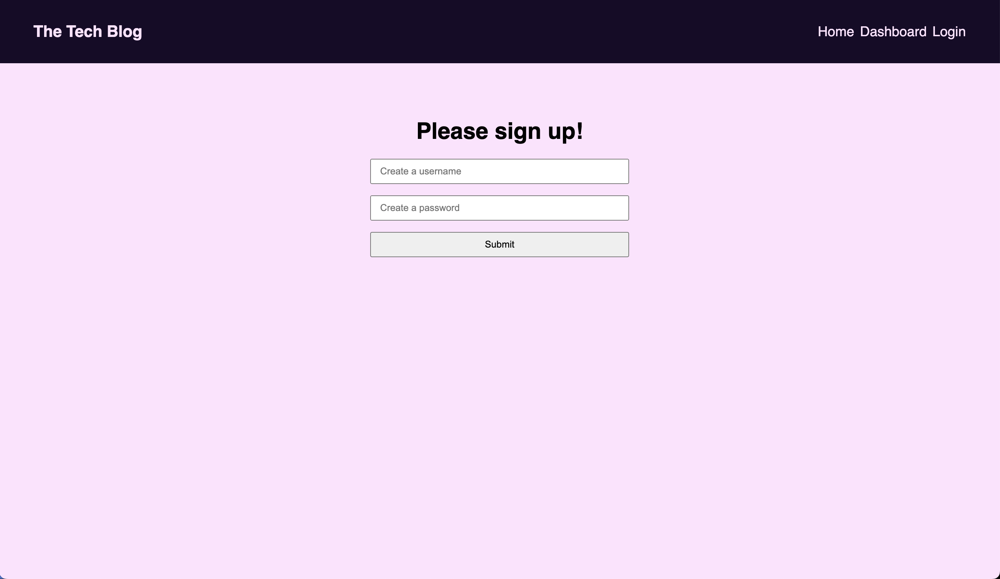
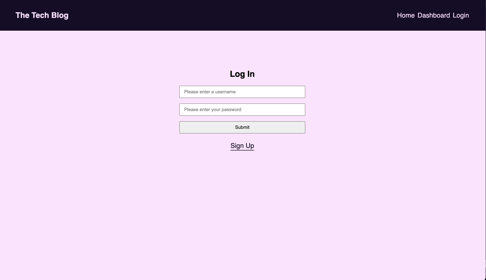
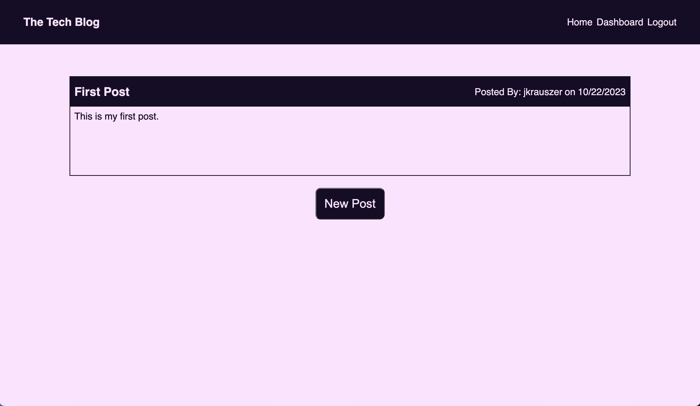
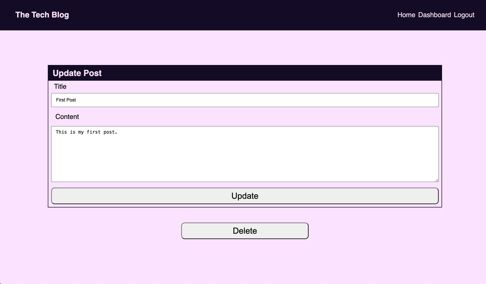
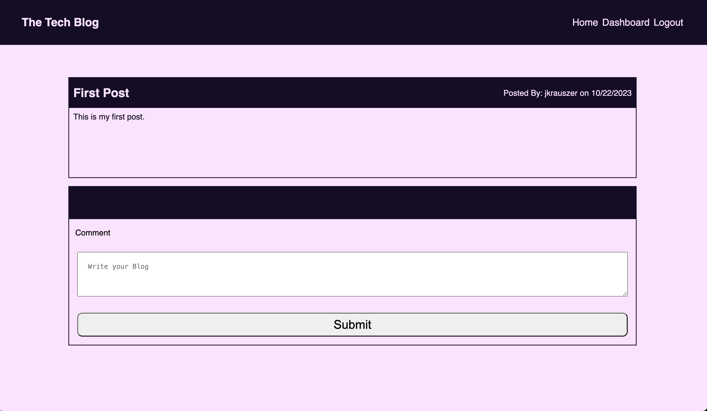

# Blog
  
## Description
  
In this assignment we were tasked with developing a blog post app that lets the user enter a new blog, add a comment/update an existing blog or delete the blog.

## Installation

npm i inquirer@8.2.4 bcrypt dayjs dotenv express express-handlebars express-session method-override mysql2 sequelize

## Usage

https://limitless-earth-15924-0574e8094217.herokuapp.com/

 ## Questions

Link to my github profile: [jarrodkrauszer](https://github.com/jarrodkrauszer)

Here is a link to the project: [Bllog Post](https://github.com/jarrodkrauszer/blog_post)
  
If you have any further questions you can email me at: [jarrod.krauszer@gmail.com](jarrod.krauszer@gmail.com)

Here is a link to the deployed code on heroku: [Blog Post](https://limitless-earth-15924-0574e8094217.herokuapp.com/)